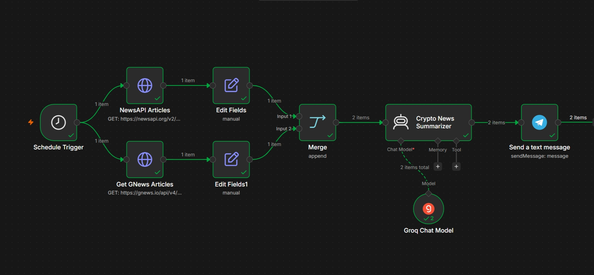

# **Crypto News Summarizer using n8n and Groq AI**


An automated n8n workflow that fetches daily top cryptocurrency news from GNews and NewsAPI, filters and summarizes the content using Groq's Qwen model via a Langchain AI Agent, and automatically sends formatted daily briefings to Telegram.

## **Workflow Preview**

<p align="center">
  
</p>

## Tech Stack

| Technology | Purpose |
|------------|---------|
| **n8n** | Workflow Automation Engine |
| **GNews API & NewsAPI** | Cryptocurrency News Data Sources |
| **Groq API** | LLM Inference (`qwen/qwen3.8-27b`) |
| **LangChain AI Agent** | News Selection, Filtering, and Summarization Logic |
| **Telegram Bot API** | Automated Daily Summary Delivery |

## How It Works

1. **Schedule Trigger:** Triggers automatically every morning at 7:00 AM.
2. **Fetch Articles:** Simultaneously queries **GNews API** and **NewsAPI** for the latest crypto news.
3. **Field Normalization & Merge:** Cleans up payload structures and merges articles into a unified stream.
4. **AI Processing:** LangChain Agent filters the top 15 most relevant articles, generates 1-2 sentence summaries with source links, and formats the output.
5. **Notification:** Sends the finalized summary briefing directly to your configured Telegram chat or channel.

## Setup Instructions

### 1. Clone this repository
```bash
git clone [https://github.com/hithursan/Crypto-News-Summarizer-n8n.git](https://github.com/hithursan/Crypto-News-Summarizer-n8n.git)
cd Crypto-News-Summarizer-n8n
```

### 2. Configure Environment Variables
Create a .env file in your n8n environment or configure environment variables for your instance:
```bash
GNEWS_API_KEY=your_gnews_api_key
NEWSAPI_KEY=your_newsapi_key
TELEGRAM_CHAT_ID=your_telegram_chat_id
```

### 3. Import the Workflow
1. Open your n8n instance.

2. Go to Workflows ➔ Import from File.

3. Select **workflow.json.**

### 4. Set up Credentials in n8n
1. **Groq API Account:** Add your Groq API key in n8n credential settings.

2. **Telegram Account:** Add your Telegram Bot Token in n8n credential settings.

### 5. Activate the Workflow
Toggle the workflow status to Active to begin receiving daily crypto updates!

## Project Structure
```
crypto-news-summarizer-n8n/
├── workflow.json              n8n workflow export
├── README.md                  Project documentation
├── .env.example               Template for environment variables
├── .gitignore                 Ignored local and sensitive files
└── images/
    └── workflow-screenshot.png
```

##  Author

**Hithursan Navaretnarasa**

---
<div align="center" font-wight=800>
Crafted with ❤️ for the modern connoisseu#
</div>
